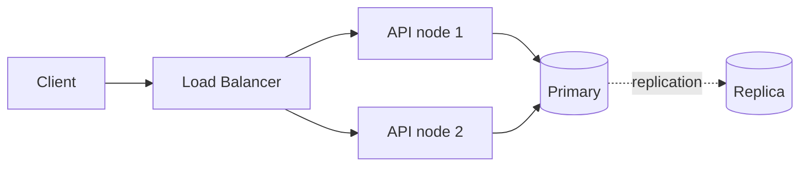

# CLAUDE.md — quy ước cho repo `java-project`

Bài tập môn kiến trúc phần mềm, mục tiêu **junior → middle**. Trọng tâm là hiểu **design
pattern và kiến trúc**, không phải xây hệ thống production.

- **Chỉ Backend.** Repo không biết gì về Frontend — giả định đã nhận được API phù hợp.
- **Giữ đơn giản.** Không tự thêm security, cache, queue, phân trang… nếu đề không yêu cầu.
- Mỗi `assN/` **độc lập**: thư mục riêng, không chia sẻ code, không tạo module dùng chung.

---

## ĐỌC TRƯỚC: xác định loại bài

Không phải bài nào cũng là bài viết code. **Đọc đề và phân loại trước khi làm bất cứ gì** —
áp nhầm quy ước là hỏng ngay từ đầu.

| Loại | Đề yêu cầu | Deliverable chính | Theo phần |
|---|---|---|---|
| **A — Code** | "Triển khai", "implement", "tái cấu trúc", "viết API" | Mã nguồn chạy được + test | [Phần A](#phần-a--bài-viết-code) |
| **B — Thiết kế** | "Thiết kế", "chọn", "so sánh", "justify", "cung cấp diagram" | `README.md` của bài + diagram | [Phần B](#phần-b--bài-thiết-kế--tài-liệu) |

**Bài lai** rất hay gặp: đề loại B kèm *"Bonus: implement small API"*. Khi đó phần thiết kế
là bài nộp chính, code là phụ — **làm tài liệu trước, code sau**, và code giữ tối giản nhất
có thể theo Phần A.

Nếu đọc đề mà không chắc thuộc loại nào → **hỏi người dùng**, đừng đoán.

---

## Quy ước chung — mọi loại bài

- **Không comment trong mã nguồn.** Nếu thật sự cần: tiếng Việt **không dấu** (tránh lỗi
  encoding). File `.md` viết đầy đủ dấu.
- Tên class / method / biến: tiếng Anh, chuẩn Java. `@DisplayName` và tên method test: tiếng
  Việt không dấu, mô tả hành vi.
- Mỗi bài có `README.md` riêng, ghi rõ **phần nào là giả định của người làm bài**, phần nào
  lấy từ đề.
- Cập nhật bảng trong `README.md` ở root khi thêm bài mới.
- **Không tự ý `git commit` / `push`.** Mặc định là nhánh `main` — nếu được yêu cầu commit
  thì tạo branch trước.

---

## Kiến thức: khi nào được khẳng định, khi nào phải kiểm chứng

Các bài sau sẽ đụng nhiều chủ đề mà file này **không** chứa sẵn kiến thức: CAP, PACELC,
Consistency Models, Redis, message queue, sharding… **Không được bịa.** Quy tắc phân loại:

| Loại thông tin | Cách xử lý |
|---|---|
| Khái niệm nền tảng, ổn định nhiều năm (định nghĩa CAP, linearizability là gì, Redis là in-memory store) | Được khẳng định trực tiếp |
| **Giá trị mặc định của config** (`writeConcern` mặc định, `maxmemory-policy` mặc định, isolation level mặc định) | **PHẢI kiểm chứng** — đọc tài liệu chính thức hoặc chạy thử |
| **Tên chính xác của tham số / API** | **PHẢI kiểm chứng** |
| **Hành vi theo phiên bản** ("từ bản X trở đi thì…") | **PHẢI kiểm chứng**, ghi rõ phiên bản |
| **Con số hiệu năng, benchmark, giới hạn** | **KHÔNG được đưa ra** nếu không có nguồn. Thà viết "cần đo" còn hơn bịa một con số nghe hợp lý |

Cách kiểm chứng, theo thứ tự ưu tiên:

1. **Chạy thử** — dựng container, gọi lệnh, đọc kết quả thật. Đáng tin nhất.
2. **Đọc tài liệu chính thức** bằng `WebFetch` / `WebSearch`. Ghi link vào README của bài.
3. **Hỏi người dùng** nếu đề bài đã quy định sẵn.

Nếu không làm được cả ba thì **nói thẳng là không chắc**, đánh dấu trong tài liệu là *"giả
định, chưa kiểm chứng"*, và đi tiếp — đừng im lặng viết như thể đã chắc.

**Kiến thức đã kiểm chứng thì ghi vào `README.md` của bài đó, không nhồi vào file này.**
File này nói *cách làm việc*; README của bài nói *đã học được gì*. Chỉ những cái **bẫy hay
mắc lại nhiều lần** mới đáng đưa lên đây — xem mục *Ghi chú theo chủ đề* ở Phần B.

---

# PHẦN A — bài viết code

## Lệnh

Chỉ cần **JDK 21** — `mvnw` tự tải Maven lần đầu. Luôn `cd` vào thư mục bài trước.

```bash
.\mvnw test                 # PHẢI xanh trước khi báo xong
.\mvnw spring-boot:run
```

**Spring Boot MVC + annotation** là mặc định. Đừng thêm Gradle, đừng đổi build tool, đừng
thêm Lombok.

## Kiến trúc: Clean Architecture

Ba package gốc:

```
adapter/        in/web, out/persistence, config — nơi DUY NHẤT biết Spring
application/    port/in, port/out, usecase
domain/         nghiệp vụ thuần
```

**THE DEPENDENCY RULE:** tầng trong không biết gì về tầng ngoài. `import` luôn chỉ vào trong.
Framework là dependency trong `pom.xml`, không phải package trong dự án.

### Hai chỗ cắt bắt buộc

```
<X>Controller          adapter/in/web
      ▼
<X>UseCase             application/port/in      ← CẮT 1: cổng VÀO
<X>Service             application/usecase
      ▼
<Aggregate>            domain
      ▼
<X>Repository          application/port/out     ← CẮT 2: cổng RA
<X>RepositoryAdapter   adapter/out/persistence
      ▼
<X>JpaRepository → Hibernate → DB
```

Cả hai chỗ: **tầng trong định nghĩa interface, tầng ngoài implements**. Spring nối lúc chạy,
không phải lúc biên dịch.

### Annotation

| Tầng | Được dùng |
|---|---|
| `domain/` | **CẤM TUYỆT ĐỐI** — không Spring, không JPA, không Jackson |
| `application/` | `@Service`, `@Transactional` — nhưng **không** import `adapter/` |
| `adapter/` | Thoải mái |

Mục tiêu không phải "không dùng framework", mà là "framework không thọc vào lõi nghiệp vụ".

> **Bẫy:** `@Transactional` trên use case chỉ chạy qua proxy Spring. Test bằng `new` trực
> tiếp thì transaction im lặng không tồn tại — test xanh nhưng chạy thật lại khác.

## KHÔNG ĐƯỢC PHÉP

| # | Cấm | Vì sao |
|---|---|---|
| 1 | `domain/` import `org.springframework`, `jakarta.*`, `javax.*`, `com.fasterxml`, `java.sql` | Tầng trong cùng phải chạy được không cần framework |
| 2 | `application/` import `adapter/` | Sai hướng phụ thuộc |
| 3 | `@Entity` trên aggregate của domain | JPA bắt có constructor rỗng + setter → aggregate hết tự canh được quy tắc |
| 4 | `double` / `float` cho tiền | `0.1 + 0.2 = 0.30000000000000004`. Dùng `BigDecimal` |
| 5 | Controller gọi thẳng `JpaRepository` | Tầng application rỗng ruột dần |
| 6 | `adapter/in/**` import `adapter/out/**` | Cùng tầng nhưng phải đi qua port |
| 7 | Use case trả `ResponseEntity` hoặc biết `404`/`400` | Grep `"404"` trong `domain/`+`application/` phải ra rỗng |
| 8 | Trả object domain ra thẳng API | Thêm trường vào aggregate là response API đổi theo |
| 9 | Chép luật nghiệp vụ xuống tầng web | Hai nơi giữ một quy tắc → ngày đổi sẽ quên một nơi |
| 10 | `ddl-auto: create-drop` ngoài dev | Xoá sạch database mỗi lần khởi động |
| 11 | Xoá file chỉ vì grep không thấy ai gọi | `@RestControllerAdvice`, `@Configuration`, `@Entity`, repository Spring Data, `*Test` đều do **framework** gọi |

## NÊN LÀM

- Port ra do `application` **sở hữu**; adapter implements ngược lên. Chữ ký hàm chỉ nói ngôn
  ngữ domain — không `Entity`, không SQL, không `Jpa`.
- Repository trả `Optional`, không trả `null`. Biến "không có" thành lỗi là việc của use case.
- Quy tắc nghiệp vụ nằm trong constructor / factory method của domain, không ở Controller.
- Không setter công khai trên object domain.
- Database cấp khoá chính (`@GeneratedValue`), ứng dụng không tự đặt ID.
- Constructor injection với field `final`, không `@Autowired` trên field.
- DTO dùng `record` và lồng vào class sở hữu nó, thay vì tách file riêng.
- **Luôn ghi tên tường minh trong `@PathVariable("id")` / `@RequestParam("q")`.** Viết
  `@PathVariable Long id` bắt Spring đoán tên qua cờ compiler `-parameters`. Cờ đó có thể
  vắng mặt (IDE compile, build tool khác, class cũ còn sót trong `target/`) và lỗi chỉ hiện
  ra **lúc chạy** dưới dạng `IllegalArgumentException: Name for argument ... not specified`,
  không phải lúc biên dịch. Ghi tên ra thì bỏ hẳn được sự phụ thuộc đó.

## Dịch lỗi

Đặt trong `@RestControllerAdvice` — **nơi duy nhất** biết các con số HTTP.
Body lỗi luôn là `{ "code": ..., "message": ... }` (`code` cho máy bắt, `message` cho người đọc).

| Exception | HTTP | `code` |
|---|---|---|
| `MethodArgumentNotValidException`, `HttpMessageNotReadableException` | `400` | `BAD_REQUEST` |
| `DomainException` | `422` | `BUSINESS_RULE_VIOLATED` |
| `*NotFoundException` | `404` | `<X>_NOT_FOUND` |

**`400` ≠ `422`:** `400` = *"tôi không hiểu bạn nói gì"* (sai cú pháp, do `@NotBlank`/`@NotNull`
ở DTO request bắt). `422` = *"tôi hiểu, nhưng không làm được"* (cú pháp đúng, domain từ chối).

## Test

Tối thiểu **2 nhóm**: end-to-end (`@SpringBootTest` + `MockMvc`, gồm cả nhánh `400`/`404`/`422`)
và **fitness function**. Bài lớn hơn thì thêm test riêng cho `domain/` (chạy bằng `new`) và
`application/` (test double viết tay).

Fitness function **bắt buộc** — biến luật trong tài liệu thành ràng buộc chạy được:

```
domain khong phu thuoc application hay adapter
domain khong dinh cong nghe ha tang
application khong phu thuoc adapter
adapter/in khong phu thuoc adapter/out
```

Test của `domain/` mà cần Spring context → kiến trúc sai, không phải test sai.

## Database

Mặc định **H2 in-memory** — chạy được ngay, không cần cài gì. Trừ khi đề yêu cầu khác
(xem Phần B với bài về hệ phân tán).

---

# PHẦN B — bài thiết kế / tài liệu

Bài loại này **không có code để chạy test**, nên "xong" nghĩa là khác. Điểm số nằm ở **chất
lượng lập luận**, không ở số dòng code.

## Deliverable

`assN/README.md` **chính là bài nộp**. Cấu trúc nên có:

1. **Đề bài** — chép nguyên văn yêu cầu, để người chấm đối chiếu.
2. **Giả định** — đề thiết kế luôn thiếu thông tin. Ghi rõ những gì tự đặt ra: quy mô người
   dùng, tỉ lệ đọc/ghi, yêu cầu độ trễ, mức chấp nhận mất dữ liệu. **Không có giả định thì
   mọi lựa chọn đều vô căn cứ.**
3. **Các phương án đã cân nhắc** — ít nhất 3, kèm bảng so sánh.
4. **Quyết định + lý do** — xem mục *Justify* bên dưới.
5. **Architecture diagram** — xem mục *Diagram*.
6. **Đánh đổi đã chấp nhận** — cái gì mất đi khi chọn phương án này.
7. **Khi nào quyết định này sai** — điều kiện nào thay đổi thì phải chọn lại.

Mục 6 và 7 là thứ phân biệt bài middle với bài junior. Junior viết "tôi chọn X vì X tốt".
Middle viết "tôi chọn X, chấp nhận mất Y, và nếu Z đổi thì phải xem lại".

## Justify — bắt buộc có đánh đổi

Một lựa chọn chỉ được coi là justify khi có đủ ba phần:

- **Gắn với yêu cầu nghiệp vụ**, không phải đặc tính kỹ thuật chung chung.
  Sai: *"MongoDB phổ biến và dễ scale."*
  Đúng: *"Hệ thống là feed mạng xã hội — người dùng thấy bài chậm vài giây là chấp nhận được,
  nhưng không truy cập được thì không. Vì vậy ưu tiên A hơn C."*
- **Nêu phương án bị loại và lý do loại.** Không so sánh thì không phải quyết định.
- **Nêu cái giá phải trả.** Chọn AP thì phải nói rõ xử lý conflict thế nào khi hai node cùng
  ghi; chọn CP thì phải nói rõ hệ thống làm gì khi node thiểu số bị cô lập.

## Diagram

Dùng **Mermaid** nhúng thẳng trong `README.md` — GitHub render được, không cần công cụ ngoài,
và diff được như code. Chỉ dùng ảnh khi Mermaid không diễn đạt nổi.

````

````

Diagram phải thể hiện được: **các node, hướng replication, client đi vào đâu, và chỗ nào
network partition có thể xảy ra**. Một hình chỉ có 3 hộp nối nhau không nói lên điều gì.

## Ghi chú theo chủ đề

Mục này **chỉ chứa những cái bẫy hay mắc đi mắc lại**, không phải kho kiến thức. Mỗi khi làm
xong một bài về chủ đề mới, nếu phát hiện một hiểu nhầm phổ biến thì thêm vào đây; còn kiến
thức chi tiết thì để trong `README.md` của bài.

Chủ đề chưa có mục ở dưới (Consistency Models, Redis, message queue, sharding…) nghĩa là
**chưa ai kiểm chứng** — làm bài đó thì áp quy tắc ở mục *Kiến thức* phía trên, đừng suy ra
từ mục CAP.

### CAP / PACELC

Đây là chỗ dễ viết sai nhất, nên có checklist riêng:

- **Một node thì không có chữ P.** CAP chỉ có nghĩa khi hệ có nhiều node và mạng có thể chia
  cắt. Đề "thiết kế distributed system" mà vẽ một database đơn lẻ là lạc đề.
- **P không phải thứ được chọn.** Mạng sẽ chia cắt dù muốn hay không. Lựa chọn thật chỉ là
  **A hay C khi partition xảy ra**. Viết "tôi chọn CA" là sai.
- **Nêu PACELC, đừng dừng ở CAP.** CAP chỉ nói lúc có partition. PACELC nói thêm lúc bình
  thường (**E**lse) phải đánh đổi **L**atency với **C**onsistency — và hệ thống chạy ở trạng
  thái bình thường 99% thời gian. Biết PACELC là điểm phân biệt middle.
- **Mô tả một kịch bản partition cụ thể:** mạng đứt ở đâu, client nào rơi về phía nào, đọc
  trả về gì, ghi được chấp nhận hay từ chối, và khi mạng nối lại thì hoà giải thế nào.
- **Gắn DB đã chọn vào quadrant của nó** và nói rõ cấu hình nào đổi được quadrant:

| Database | PACELC | Đổi quadrant bằng |
|---|---|---|
| PostgreSQL + replication | PC/EC | `synchronous_commit`, số replica đồng bộ |
| MongoDB replica set | PC/EC, chỉnh được sang PA/EL | `writeConcern`, `readPreference` |
| Cassandra | PA/EL | `consistencyLevel`: ONE / QUORUM / ALL |

## Nếu đề có "Bonus: implement small API"

- Làm **sau** khi phần thiết kế xong. Tài liệu là bài nộp chính.
- Code theo Phần A nhưng **tối giản nhất có thể** — mục đích là minh hoạ quyết định thiết kế,
  không phải xây sản phẩm.
- Cách khai thác kiến trúc cho bài CAP: viết **hai adapter sau cùng một port** (ví dụ một bản
  CP, một bản AP). Đổi một dòng cấu hình là đổi đặc tính CAP của hệ thống mà `domain/` và
  `application/` không sửa một ký tự. Đó là minh chứng thuyết phục hơn mọi slide.
- Cần nhiều node thật thì dùng **Docker Compose**, kèm `docker-compose.yml` trong thư mục bài
  và hướng dẫn tạo partition (`docker stop <node>`) để người chấm tự thử được.

---

## Quy trình làm việc

**Bài code:**

1. **Chạy test trước khi báo xong.** Không suy đoán kết quả.
2. **Thay đổi lớn thì chạy thật app** rồi `curl`, gồm cả nhánh lỗi.
3. **Refactor lớn chia bước, compile sau mỗi bước** — để compiler bắt thay vì đọc mắt.
4. Sửa file hàng loạt bằng script thì cẩn thận **string literal và text block**.

**Bài thiết kế:**

5. **Không khẳng định con số mà không kiểm chứng** — thông số hiệu năng, giới hạn của DB,
   hành vi lúc failover. Không chắc thì ghi rõ là giả định.
6. **Mọi lựa chọn phải có phương án bị loại đi kèm.**

**Chung:**

7. **Xoá code thì xoá cả tài liệu trỏ tới nó.**
8. **Báo cáo trung thực** — test đỏ thì nói kèm output, bỏ bước nào thì nói.
9. **Giải thích cả *tại sao*.** Có hai cách thì nói rõ đánh đổi.

---

## Khi tạo bài mới

1. **Phân loại đề trước** (Phần A hay B) — xem mục đầu file.
2. **Chủ đề có nằm trong *Ghi chú theo chủ đề* không?** Nếu không, đọc mục *Kiến thức* và
   kiểm chứng trước khi viết dòng nào. Xong bài thì bổ sung lại bẫy đã gặp vào mục đó.
3. Thư mục riêng `assN/`. Bài code thì package gốc riêng `com.example.<domain>`, không dùng
   lại code bài cũ.
4. Bài code: copy `pom.xml`, `mvnw`/`.mvn/`, cấu trúc 3 package và fitness test từ bài gần
   nhất — đổi hằng số `PKG`. **Bắt đầu tối giản.**
5. `README.md` riêng cho bài, theo cấu trúc của loại bài tương ứng.
6. Cập nhật bảng trong `README.md` ở root.
