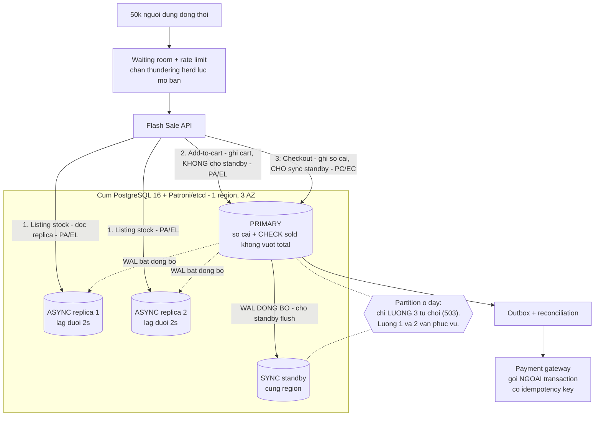

# PACELC cho hệ thống Flash Sale

```
Boi canh: Xay he thong "Flash Sale"
  - 50k nguoi dung dong thoi
  - SLO: P95 read < 80ms, P95 write < 120ms
  - Khong duoc oversell
  - Chap nhan hien thi ton kho tre toi da 2s o trang listing
  - Thanh toan phai chinh xac

Yeu cau nop:
  1. Phan loai PACELC cho tung luong: Listing stock / Add-to-cart / Checkout
  2. Chon DB va topology cho tung thanh phan
  3. De xuat cau hinh / knobs
  4. Ve so do kien truc (Mermaid)
  5. Neu rui ro + cach giam thieu (lag, thundering herd, retry, idempotency)
```

# 1. Phân loại PACELC cho từng luồng

| Luồng | **P** — khi partition | **E** — lúc bình thường | Kết luận |
|---|---|---|---|
| **Listing stock** | **A** — replica vẫn phục vụ bằng số cuối cùng nó có | **L** — đọc async replica, không chạm primary | **PA/EL** |
| **Add-to-cart** | **A** — vẫn nhận, ghi không chờ ai | **L** — `synchronous_commit = local`, commit không chờ standby | **PA/EL** |
| **Checkout** | **C** — phía thiểu số từ chối, trả `503` | **C** — commit chờ sync standby flush xuống đĩa | **PC/EC** |

Đề đã tự cho sẵn hai câu trả lời, chỉ là nói bằng ngôn ngữ nghiệp vụ: *"chấp nhận trễ tối đa
2s ở listing"* → listing được phép **EL**, và 2s là **trần lag** chứ không phải lời khuyên.
*"Không được oversell"* + *"thanh toán phải chính xác"* → checkout buộc phải **PC/EC**.

> **Cả ba luồng chạy trên CÙNG một cụm PostgreSQL.** Chúng khác nhau ở đúng **hai núm vặn**:
> *đọc từ đâu* (replica hay primary) và *commit có chờ standby không*. Đó là toàn bộ PACELC
> trong bài này — không cần thêm một hệ lưu trữ nào khác.

**Vì sao add-to-cart được AP mà hệ thống vẫn không oversell:** vì **add-to-cart không trừ kho**.
Nó chỉ ghi ý định mua của một người — dữ liệu riêng từng user, **không có bất biến toàn cục**
nào để phá. Toàn bộ việc chống oversell dồn vào một câu lệnh duy nhất ở checkout:

```sql
UPDATE stock SET sold = sold + :qty
 WHERE sku = :sku AND sold + :qty <= total;   -- rowsAffected = 0  =>  het hang
```

Đổi lại, giỏ hàng **không phải lời hứa sẽ mua được**. Người thêm vào giỏ vẫn có thể thất bại ở
checkout. Đây là đánh đổi có chủ đích: thà từ chối ở bước cuối còn hơn oversell.

# 2. Chọn DB và topology cho từng thành phần

*Giả định để chọn được topology: **1–3 SKU nóng**, tồn kho mỗi SKU vài trăm đến vài nghìn,
triển khai **một region / 3 AZ**, và "50k đồng thời" là **người đang mở trang** chứ không phải
50k ghi/giây.*

**Một engine duy nhất — PostgreSQL 16 — nhưng mỗi thành phần có topology và cấu hình riêng.**

| Thành phần | Đọc/ghi ở đâu | Cấu hình đặc trưng | Loại phương án nào, vì sao |
|---|---|---|---|
| Catalog + tồn kho hiển thị (listing) | **2 async read replica** | lag ≤ 2s, rút khỏi pool nếu vượt | *Đọc thẳng primary*: vỡ SLO 80ms và giết primary đang lo checkout |
| Giỏ hàng | **primary**, bảng `cart` | `synchronous_commit = local` | *Chờ sync standby*: mất giỏ hàng không mất tiền, không đáng trả giá latency |
| **Sổ cái đơn + tồn kho thật** | **primary** | `synchronous_commit = on` + `CHECK (sold <= total)` | Xem hai dòng NoSQL bên dưới |
| Thanh toán | **primary** + **outbox** | `payment`, `idempotency_keys`, `outbox` | *Gọi gateway trong transaction*: giữ transaction mở qua mạng ngoài, hỏng cả hai đầu |

**Topology cụm:** 1 primary + 1 **sync** standby + 2 **async** replica, ba AZ trong cùng một
region, bầu leader bằng **Patroni + etcd**. PostgreSQL thuần **không** tự failover — thiếu
Patroni thì "PC" chỉ là trên giấy.

| Phương án NoSQL bị loại | Vì sao |
|---|---|
| **Cassandra** (PA/EL) | Ghi hoà giải theo last-write-wins ở mức cột → hai lần trừ kho thì một lần **biến mất**. Dùng LWT để có compare-and-set thì đã tự bỏ đúng ưu thế AP của Cassandra |
| **MongoDB replica set** (PC/EC) | Đạt PC/EC được, nhưng **không có ràng buộc tương đương `CHECK (sold <= total)`** — mất hàng rào cuối cùng nằm trong storage engine |
| **MySQL 8** | Làm được tương đương (semi-sync, `ON DUPLICATE KEY UPDATE`). Đội đã vận hành MySQL thì **giữ MySQL đúng hơn** — chi phí đổi hệ quản trị lớn hơn lợi ích |
| **Oracle** | Không bù được chi phí license cho bài toán này |

Chọn PostgreSQL vì `CHECK (sold <= total AND sold >= 0)` biểu đạt thẳng bất biến ngay trong
storage engine, và `ON CONFLICT DO NOTHING` làm idempotency sạch sẽ.

# 3. Cấu hình / knobs

**Mỗi knob dưới đây là một cần gạt PACELC.** Cùng một cụm, đổi knob là đổi quadrant của luồng.

| Áp cho | Knob | Giá trị | Vế PACELC |
|---|---|---|---|
| Toàn cụm | `synchronous_standby_names` | `'ANY 1 (sb_sync)'` | **Bắt buộc** — thiếu dòng này thì mọi knob dưới vô nghĩa với replica |
| Checkout | `SET LOCAL synchronous_commit = on` | chờ standby flush | **E → C** |
| Giỏ hàng, log | `SET LOCAL synchronous_commit = local` | commit ngay sau WAL cục bộ | **E → L** |
| Listing | định tuyến đọc → **async replica** | chấp nhận trễ ≤ 2s | **E → L** |
| Checkout, "đơn của tôi" | định tuyến đọc → **primary** | đọc thấy chính cái mình vừa ghi | **E → C** |
| Phía thiểu số khi partition | Patroni tự **demote** primary cũ | từ chối ghi, trả `503` | **P → C** |
| Toàn cụm | **PgBouncer, transaction mode** | 50k người không thể mỗi người một connection | — |

> **Bẫy, đã kiểm chứng trong [tài liệu PostgreSQL](https://www.postgresql.org/docs/current/runtime-config-wal.html):**
> `synchronous_commit = on` **là giá trị mặc định**, nghe như replication đồng bộ đã bật sẵn.
> Nhưng khi `synchronous_standby_names` rỗng thì mọi mức khác `off` **chỉ đảm bảo flush WAL
> cục bộ**, không chờ standby nào cả. Viết *"chúng tôi để mặc định nên đã là EC"* là sai.

**Trừ kho** dùng một câu `UPDATE` có điều kiện (mục 1) — nguyên tử sẵn, **không cần**
`SELECT … FOR UPDATE` riêng; tách làm hai câu chỉ thêm một khoảng hở và một round-trip. Thêm
`CHECK (sold <= total AND sold >= 0)` làm hàng rào cuối cùng, phòng khi có service khác hoặc
một câu UPDATE chạy tay đi vòng qua logic.

**Giám sát lag — biến SLO 2s thành hành động:** `now() - pg_last_xact_replay_timestamp() > 2s`
→ health check trả unhealthy → **rút replica khỏi pool listing**. Cảnh báo sớm ở 1s.
**Read-your-writes** cho trang "đơn của tôi": **sticky to primary** N giây sau khi ghi — số
người vừa checkout rất nhỏ so với 50k người đang xem listing.
([tên hàm đã kiểm chứng](https://www.postgresql.org/docs/current/functions-admin.html))

# 4. Sơ đồ kiến trúc



Ba mũi tên từ API là ba luồng, và **quadrant của mỗi luồng do đúng đường đi của nó quyết
định**: listing rẽ sang async replica nên PA/EL; add-to-cart ghi primary nhưng không chờ ai
nên vẫn PA/EL; checkout ghi primary **và chờ sync standby** nên PC/EC. Khi mạng đứt, chỉ luồng
thứ ba từ chối phục vụ.

# 5. Rủi ro và cách giảm thiểu

| Rủi ro | Xảy ra thế nào | Giảm thiểu |
|---|---|---|
| **Replication lag** | Replica tụt lại, listing hiện "còn 120" trong khi đã hết; khách bấm vào rồi bị từ chối ở checkout | Health check theo `pg_last_xact_replay_timestamp()`, **lag > 2s thì rút replica khỏi pool** · hiển thị **"sắp hết hàng"** thay vì con số chính xác · sticky-to-primary cho trang "đơn của tôi" |
| **Thundering herd** — lúc mở bán | 50k người bấm F5 tại giây 0. Đây là **tải thật**, không có lớp nào đỡ thay được | **Waiting room** phát token trước giờ mở bán · **rate limit theo user**, không chỉ theo IP · mở bán **theo lô** thay vì mở một lúc |
| **Thundering herd** — dồn vào primary | Mọi request đọc cùng rơi về primary khi một replica bị rút khỏi pool | Luôn giữ **≥ 2 replica**; rút một cái thì cái còn lại còn gánh được · degrade sang "sắp hết hàng" thay vì đọc primary |
| **Hot row contention** | Mọi checkout của SKU nóng cùng `UPDATE` một dòng → xếp hàng sau một khoá → P95 write vỡ dù CPU vẫn rảnh | Waiting room chặn bớt từ đầu · **sharded counter**: chia tồn kho SKU nóng thành N dòng con, mỗi request chọn ngẫu nhiên một dòng, gộp lại khi gần hết |
| **Retry storm** | Hệ chậm → client retry → gateway retry → app retry. Tải nhân 3 đúng lúc hệ yếu nhất | **Chỉ retry `5xx` và timeout, không bao giờ retry `4xx`** · **backoff + jitter** (thiếu jitter thì client retry đồng pha, tự tạo sóng mới) · **retry budget** ~10% · circuit breaker · trả `Retry-After` |
| **Idempotency** | Checkout timeout ở giây thứ 3. Đơn **đã** ghi nhưng response không về; client retry → trừ kho và thu tiền hai lần | `Idempotency-Key` **do client sinh**, `INSERT … ON CONFLICT DO NOTHING` vào `idempotency_keys` **trong cùng transaction** với việc trừ kho; lưu cả `request_hash` — cùng key khác nội dung là lỗi client (`422`), không im lặng trả kết quả cũ |
| **Thanh toán hai lần** | Gọi gateway trong transaction → gateway chậm thì giữ khoá hàng chục giây; hoặc gọi xong mà rollback → tiền đã thu, đơn không có | **Không gọi mạng ngoài trong transaction** · **outbox pattern** · dùng **idempotency key của chính gateway** · **job đối soát** định kỳ so sổ của mình với sổ của gateway |
| **Cửa sổ mất ghi lúc failover** | Patroni promote standby, vài chục giây không ghi được | Hiếm và tự phục hồi; client đã có backoff + `Retry-After`. Thời gian thật phụ thuộc `ttl`/`loop_wait` — **phải đo khi triển khai, không đoán** |
