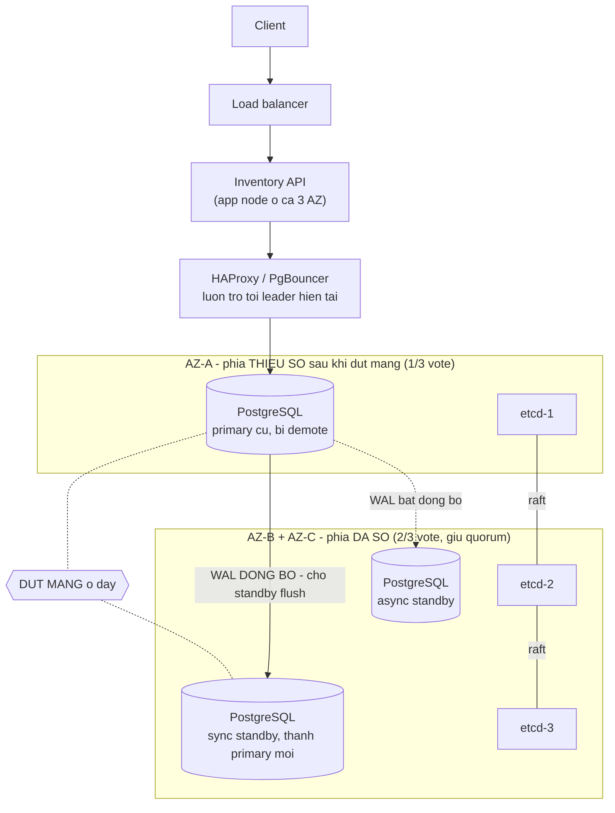

# ass3 — Thiết kế distributed system & quyết định CAP

> **Loại bài:** B (thiết kế) + bonus code. Theo `CLAUDE.md`, tài liệu này là bài nộp chính;
> phần API bên dưới chỉ để minh hoạ quyết định thiết kế.

## 1. Đề bài (nguyên văn)

```
Task: Thiết kế một distributed system

Requirements:
  - Chọn DB (SQL hoặc NoSQL)
  - Quyết định CAP strategy
  - Justify choice
  - Cung cấp architecture diagram
  - Bonus: implement small API
```

## 2. Hệ thống được chọn để thiết kế

Đề chỉ nói "một distributed system" nên tôi tự chọn bài toán. Chọn phần **dễ sai nhất** của
một sàn thương mại điện tử:

> **Inventory Reservation Service** — dịch vụ giữ chỗ tồn kho. Khi khách bấm "Đặt hàng",
> hệ thống phải trừ tồn kho của SKU đó trước khi cho thanh toán.

Lý do chọn: đây là nghiệp vụ mà **CAP không còn là lý thuyết**. Một bất biến duy nhất —
*không bán nhiều hơn số hàng đang có* — buộc phải chọn dứt khoát giữa C và A, và chọn sai
thì hậu quả đo được bằng tiền.

## 3. Giả định (do người làm bài tự đặt ra, không có trong đề)

Đề thiết kế luôn thiếu thông tin. Không có các giả định này thì mọi lựa chọn bên dưới đều
vô căn cứ. **Tất cả đều là giả định, không phải số đo thật.**

| Giả định | Giá trị | Ảnh hưởng tới quyết định |
|---|---|---|
| Quy mô | ~2 triệu tài khoản, cao điểm flash sale ~5.000 req/s vào dịch vụ giữ chỗ | Một primary vẫn gánh được → chưa cần sharding |
| Tỉ lệ đọc/ghi | ~20 đọc : 1 ghi | Đọc nhiều nhưng ghi mới là chỗ tranh chấp |
| Hàng hoá | Vật lý, tồn kho **hữu hạn**, có SKU nóng chiếm phần lớn traffic | Có bất biến `available >= 0` không thể bỏ |
| Triển khai | 3 AZ trong **cùng một region** | Round-trip nội region đủ rẻ để chờ đồng bộ |
| Mất mát chấp nhận được | **0 đơn đã xác nhận** bị mất; nhưng chấp nhận **từ chối phục vụ vài chục giây** khi mất một AZ | Ưu tiên C hơn A |
| Chi phí của oversell | Phải huỷ đơn đã thu tiền, hoàn tiền, mất uy tín | Không hoà giải tự động được |

## 4. Các phương án đã cân nhắc

| | **PostgreSQL 16 + Patroni/etcd** | **MongoDB replica set** | **Cassandra (RF=3)** |
|---|---|---|---|
| Mô hình | Quan hệ, ACID | Document | Wide-column, không leader |
| CAP khi partition | **CP** | **CP** (mặc định) | **AP** |
| PACELC | PC/EC | PC/EC, chỉnh được sang PA/EL | PA/EL |
| Núm vặn đổi quadrant | `synchronous_standby_names`, `synchronous_commit` | `writeConcern`, `readPreference` | `consistencyLevel` mỗi query |
| Chặn oversell ở tầng storage | `CHECK (available >= 0)` + `SELECT … FOR UPDATE` | Transaction + update có điều kiện; **không có** CHECK constraint tương đương | **Không có**; phải dùng LWT (Paxos) |
| Ghi khi mất 1 node | Còn ghi được (quorum 2/3) | Còn ghi được | Còn ghi được |
| Điểm yếu chính | Mọi ghi qua 1 primary | Cũng 1 primary, thêm một hệ vận hành mới | Không giữ nổi bất biến hữu hạn |

## 5. Quyết định

> **Chọn PostgreSQL 16, cụm 3 node quản lý bởi Patroni + etcd, chiến lược CP.
> PACELC: PC/EC.**

### 5.1. Vì sao CP, gắn với nghiệp vụ

Giữ chỗ tồn kho là một phép **đọc — so sánh — ghi** trên đúng một dòng. Nếu hai phía của một
partition cùng cho phép thao tác này, cả hai đều tin là còn hàng, và kết quả là **bán cái áo
cuối cùng cho hai người**.

Điểm mấu chốt: **oversell không có cách hoà giải tự động.** Với giỏ hàng hay lượt xem, khi
mạng nối lại ta có thể hợp nhất hai phiên bản và không ai thiệt. Với tồn kho thì không —
máy không thể "bán ngược lại" một cái áo không tồn tại. Cách duy nhất là **huỷ một đơn đã
thu tiền**, tức là đẩy chi phí của lỗi kỹ thuật sang cho khách hàng.

Ngược lại, cái giá của C rất rẻ trong bài toán này: khách gặp lỗi *"hệ thống bận, thử lại"*
trong vài chục giây. Khó chịu, nhưng phục hồi được và không mất tiền.

> Đây cũng là lý do dịch vụ **giữ chỗ tồn kho** khác với **trang chi tiết sản phẩm** hay
> **lượt xem**. Những thứ đó nên để AP. Bài này chỉ thiết kế cho dịch vụ giữ chỗ.

### 5.2. Vì sao loại Cassandra

Cassandra là lựa chọn AP tự nhiên và sẽ thắng về throughput. Bị loại vì:

- Ghi mặc định hoà giải theo **last-write-wins** ở mức cột. Hai phía cùng trừ tồn kho thì
  một trong hai lần trừ **biến mất** — không phải chậm, mà là mất hẳn.
- Có thể dùng **LWT (lightweight transaction, Paxos)** để có compare-and-set. Nhưng LWT cần
  đồng thuận cho từng thao tác — tức là **tự tay bỏ đi đúng cái ưu thế AP** mà ta chọn
  Cassandra để có. Chọn một công cụ rồi tắt tính chất của nó là chọn sai công cụ.
- Thêm nữa, SKU nóng trong flash sale tạo **hot partition** — đúng kiểu tải mà mô hình
  partition key của Cassandra ghét nhất.

### 5.3. Vì sao loại MongoDB

MongoDB replica set **hoàn toàn đạt CP** được: write concern mặc định là `w: "majority"`
(có ngoại lệ với cụm có arbiter — xem mục Nguồn), cộng transaction là đủ cho bài này. Bị loại
vì một lý do cụ thể chứ không phải "PostgreSQL tốt hơn":

**PostgreSQL cho phép đặt `CHECK (available >= 0)` ngay trong bảng.** Đó là hàng rào cuối
cùng nằm *trong* storage engine: kể cả khi tầng application có bug, khi ai đó chạy nhầm một
câu UPDATE tay, hay khi một service mới quên mất luật nghiệp vụ — database vẫn từ chối.

Với bất biến mà vi phạm nó đồng nghĩa mất tiền, một hàng rào không thể bị code đi vòng qua
đáng giá hơn mọi lợi thế khác. MongoDB không có ràng buộc tương đương ở mức tương tự.

### 5.4. Cấu hình cụ thể tạo ra tính chất CP

| Mục | Cấu hình | Tác dụng |
|---|---|---|
| Đồng bộ replica | `synchronous_standby_names = 'ANY 1 (az_b, az_c)'` | Commit phải được ít nhất 1 standby flush |
| Độ bền commit | `synchronous_commit = on` | Chờ standby ghi xuống đĩa bền |
| Bầu leader | Patroni + etcd 3 node (mỗi AZ 1) | Phía mất quorum etcd tự **demote**, không có split-brain |
| Định tuyến | HAProxy/PgBouncer luôn trỏ tới leader hiện tại | Client không tự ý ghi vào standby |
| Chặn oversell | `CHECK (available >= 0)`, cập nhật bằng `SELECT … FOR UPDATE` | Hàng rào trong storage engine |

> **Bẫy quan trọng, đã kiểm chứng trong tài liệu chính thức:** `synchronous_commit = on` là
> **giá trị mặc định** của PostgreSQL, nhưng **một mình nó KHÔNG tạo ra synchronous
> replication**. Khi `synchronous_standby_names` rỗng, mọi mức khác `off` đều chỉ có nghĩa là
> *flush WAL xuống đĩa cục bộ*. Nói "chúng tôi dùng mặc định nên đã có replication đồng bộ"
> là sai. Phải đặt `synchronous_standby_names` thì `synchronous_commit` mới điều khiển
> hành vi chờ standby.

### 5.5. PACELC — phần mà CAP không nói

CAP chỉ mô tả lúc **có** partition, mà hệ thống chạy bình thường gần như toàn bộ thời gian.
PACELC bổ sung vế còn lại:

- **PA/PC — khi partition (P):** chọn **C**. Phía thiểu số ngừng phục vụ.
- **EL/EC — khi bình thường (Else):** chọn **C**. Mỗi commit chờ thêm một round-trip tới
  standby, đổi **latency** lấy **consistency** (không mất dữ liệu nếu primary chết đột ngột).

Chuyển sang **EL** chỉ là để `synchronous_standby_names` rỗng: commit trả về ngay sau khi ghi
WAL cục bộ, ghi nhanh hơn, nhưng primary chết thì các commit chưa kịp sang standby **mất
hẳn**. Với đơn hàng đã thu tiền thì không chấp nhận được, nên giữ **EC**.

## 6. Architecture diagram



## 7. Kịch bản partition cụ thể

Mạng giữa **AZ-A** và **{AZ-B, AZ-C}** đứt. Cả hai phía đều còn sống, chỉ không thấy nhau.

| Bước | AZ-A (1/3 node — thiểu số) | AZ-B + AZ-C (2/3 node — đa số) |
|---|---|---|
| 1. Phát hiện | `etcd-1` mất quorum | `etcd-2` + `etcd-3` vẫn đủ quorum (2/3) |
| 2. Vai trò | Patroni **tự demote** primary cũ xuống read-only | Patroni promote sync standby ở AZ-B thành **primary mới** |
| 3. Ghi | **Từ chối** → HTTP `503` | Chấp nhận bình thường |
| 4. Đọc | **Từ chối** — nếu cho đọc thì trả về dữ liệu cũ, phá vỡ linearizability | Trả dữ liệu mới nhất |
| 5. Khách hàng thấy gì | *"Hệ thống đang bận, vui lòng thử lại"* | Không thấy gì bất thường |

**Khi mạng nối lại — và đây là phần thưởng thật sự của CP:**

Primary cũ ở AZ-A có thể đã ghi vài WAL record chưa kịp được thừa nhận. Nó **không được**
quay lại làm primary. Patroni chạy **`pg_rewind`** — công cụ chính thức của PostgreSQL để
đồng bộ một cluster đã phân kỳ timeline, cụ thể là để đưa một primary cũ trở lại sau failover
với vai trò standby đi theo primary mới. Các thay đổi chưa được thừa nhận bị **bỏ đi**.

**Không có gì để hoà giải.** Không có merge, không có conflict resolution, không có đơn hàng
mồ côi. Đó chính là cái ta mua được bằng việc hy sinh A.

## 8. Đánh đổi đã chấp nhận

| Mất gì | Mức độ | Vì sao chấp nhận |
|---|---|---|
| Phía thiểu số ngừng phục vụ **cả đọc lẫn ghi** | Toàn bộ thời gian partition | Đọc tồn kho cũ dẫn tới khách đặt hàng rồi bị huỷ — tệ hơn là báo lỗi ngay |
| Cửa sổ không ghi được lúc failover | Vài chục giây (phụ thuộc `ttl`/`loop_wait` của Patroni — **cần đo khi triển khai, không khẳng định con số**) | Hiếm, và phục hồi tự động |
| Latency ghi cao hơn | Thêm 1 round-trip nội region mỗi commit | Đổi lấy không mất đơn hàng |
| Ghi không scale ngang | Mọi ghi qua 1 primary | Với quy mô đã giả định thì chưa chạm trần |
| Vận hành phức tạp hơn | Phải chạy thêm etcd + Patroni | PostgreSQL thuần **không** có failover tự động; thiếu Patroni thì "CP" chỉ là trên giấy |

## 9. Khi nào quyết định này sai

Quyết định trên chỉ đúng trong khung giả định ở mục 3. Phải chọn lại nếu:

1. **Hàng hoá trở thành vô hạn** (ebook, khoá học, vé điện tử không giới hạn). Không còn bất
   biến hữu hạn → không còn lý do hy sinh A → chuyển sang AP.
2. **Nghiệp vụ chấp nhận oversell và bù bằng chính sách.** Nhiều sàn thật cho oversell khi
   tồn kho dư dả, rồi huỷ đơn kèm voucher. Nếu chi phí voucher rẻ hơn chi phí mất đơn lúc
   partition thì AP thắng về kinh tế. **Đây là quyết định kinh doanh, không phải kỹ thuật.**
3. **Mở rộng đa region xuyên lục địa.** Chờ quorum vòng quanh trái đất quá đắt. Lời giải
   không phải đổi sang AP, mà là **chia tồn kho theo region** — mỗi region sở hữu một phần
   tồn kho riêng và vẫn CP cục bộ trong region đó.
4. **Lưu lượng ghi vượt sức một primary.** Chuyển sang **sharding theo SKU**; mỗi shard vẫn
   là một cụm CP. Bất biến tồn kho nằm gọn trong một SKU nên nó shard được sạch sẽ.
5. **Xuất hiện yêu cầu đọc rất lớn và chịu được dữ liệu cũ** (ví dụ hiển thị "còn vài sản
   phẩm"). Tách riêng đường đọc đó sang replica bất đồng bộ hoặc cache — **đọc AP, ghi CP**.

---

# Bonus — small API

Một Spring Boot app **mô phỏng cụm 3 node** để chứng minh mục 5 và 8 bằng code chạy được,
thay vì chỉ khẳng định trên slide.

## Ý tưởng khai thác Clean Architecture

`application/port/out/StockRepository` là **một port duy nhất**, có **hai adapter**:

```
                    ReserveStockService      (application - khong sua mot ky tu)
                              |
                       StockRepository       (port, application/port/out)
                        /            \
        CpStockRepository              ApStockRepository    (adapter/out/cluster)
      doi quorum moi doc/ghi          luon phuc vu tai cho
```

Đổi **một dòng cấu hình** là đổi đặc tính CAP của cả hệ thống, trong khi `domain/` và
`application/` giữ nguyên:

```yaml
app:
  cap:
    strategy: cp   # hoac: ap
```

Hai adapter được chọn bằng `@ConditionalOnProperty`, nên tại một thời điểm chỉ có đúng một
bean `StockRepository` trong context.

## Mô hình cụm

3 node: `node-1`, `node-2` (phía đa số) và `node-3` (phía thiểu số). Quorum = 2.
Client chọn node mình kết nối tới bằng header **`X-Node`** (mặc định `node-1`) — mô phỏng
việc client được định tuyến tới bản sao gần nhất.

| Adapter | Đọc | Ghi |
|---|---|---|
| **CP** | Cần quorum, không đủ → `503` | Cần quorum, ghi tới mọi node liên lạc được |
| **AP** | Đọc bản sao cục bộ, luôn thành công | Ghi tới các node cùng phía, luôn thành công |

## Endpoint

| Method | Path | Ý nghĩa |
|---|---|---|
| `POST` | `/api/cluster/reset` | Nạp lại tồn kho, nối lại mạng. Body: `{"TSHIRT-M":5}` |
| `POST` | `/api/cluster/partition` | Cắt mạng: `node-3` bị cô lập |
| `POST` | `/api/cluster/heal` | Nối lại mạng và **hoà giải**, trả về báo cáo |
| `GET` | `/api/cluster` | Trạng thái từng node |
| `POST` | `/api/stock/{sku}/reserve` | Giữ chỗ. Body: `{"quantity":3}` |
| `GET` | `/api/stock/{sku}` | Đọc tồn kho trên node đang kết nối |

Ánh xạ lỗi (mở rộng bảng chuẩn trong `CLAUDE.md` bằng một dòng `503`):

| Tình huống | HTTP | `code` |
|---|---|---|
| Thiếu `quantity`, `X-Node` không tồn tại | `400` | `BAD_REQUEST` |
| SKU không có | `404` | `SKU_NOT_FOUND` |
| Hết hàng (domain từ chối) | `422` | `BUSINESS_RULE_VIOLATED` |
| **Không đủ quorum (cái giá của C)** | `503` | `CLUSTER_UNAVAILABLE` |

> `422` và `503` khác nhau về bản chất: `422` = *"tôi biết chắc là không còn hàng"*.
> `503` = *"tôi không biết còn hàng hay không, và tôi từ chối đoán"*.

## Chạy

```bash
.\mvnw test
.\mvnw spring-boot:run
```

Chạy ở chế độ AP:

```bash
.\mvnw spring-boot:run "-Dspring-boot.run.arguments=--app.cap.strategy=ap"
```

## Kết quả thật đã chạy

### Chế độ CP — phía thiểu số ngừng phục vụ, không oversell

```
POST /api/cluster/partition
POST /api/stock/TSHIRT-M/reserve   X-Node: node-1   {"quantity":3}
  -> 200  {"sku":"TSHIRT-M","reserved":3,"available":2}

POST /api/stock/TSHIRT-M/reserve   X-Node: node-3   {"quantity":3}
  -> 503  {"code":"CLUSTER_UNAVAILABLE",
           "message":"Node node-3 chi lien lac duoc 1 node, can toi thieu 2"}

GET  /api/stock/TSHIRT-M           X-Node: node-3
  -> 503  (doc cung bi tu choi, vi doc du lieu cu cung la vi pham C)

POST /api/stock/TSHIRT-M/reserve   (node-1, ban not 2 roi ban them 1)
  -> 422  {"code":"BUSINESS_RULE_VIOLATED","message":"Ton kho khong du: con 0, can 1"}

POST /api/cluster/heal
  -> {"sku":"TSHIRT-M","initial":5,"totalReserved":5,"mergedAvailable":0,"oversold":0}
```

### Chế độ AP — luôn phục vụ, trả giá lúc hoà giải

```
POST /api/cluster/partition
POST /api/stock/TSHIRT-M/reserve   X-Node: node-1   {"quantity":3}   -> 200  available: 2
POST /api/stock/TSHIRT-M/reserve   X-Node: node-3   {"quantity":3}   -> 200  available: 2

POST /api/cluster/heal
  -> {"sku":"TSHIRT-M","initial":5,"totalReserved":6,"mergedAvailable":-1,"oversold":1}
```

**Đã bán 6 cái trong khi chỉ có 5.** Và điều đáng nói nhất:

> Phép hoà giải ở đây **không hề sai**. Nó cộng đúng toàn bộ thao tác của cả hai phía, không
> mất một đơn nào — đúng theo tinh thần CRDT. Nhưng kết quả vẫn **vi phạm nghiệp vụ**, vì
> bất biến `available >= 0` không phải thứ có thể khôi phục bằng cách gộp dữ liệu.
>
> Đây là bài học chính của cả bài: **conflict resolution hoà giải được dữ liệu, nhưng không
> hoà giải được bất biến.** Cách duy nhất còn lại là bù bằng nghiệp vụ — huỷ một đơn, xin lỗi,
> tặng voucher.

Hệ quả thứ hai, nhìn thấy trong `StockItemTest`: **bất biến của domain chỉ đúng trên bản sao
đã kiểm tra nó.** `StockItem.reserve()` chặn đúng luật trên từng node, nhưng không node nào
biết node kia cũng vừa chặn đúng luật cho cùng một cái áo. Rich domain model là điều kiện
**cần**, không phải điều kiện **đủ**, trong hệ phân tán.

## Những chỗ bản mô phỏng khác với thực tế

Ghi ra để không nhầm bản demo với hệ thật:

1. **Không có PostgreSQL.** Cụm là `Map` trong bộ nhớ. Mục đích là minh hoạ hành vi CP/AP,
   không phải đo hiệu năng.
2. **Không có bầu leader thật.** Phía đa số / thiểu số được cố định sẵn; Patroni thật bầu lại
   leader dựa trên lease trong etcd.
3. **Adapter CP từ chối cả đọc ở phía thiểu số.** Một replica PostgreSQL thật vẫn sẵn sàng
   trả **dữ liệu cũ** trừ khi ta chủ động chặn. Ở đây chọn mô hình CP chặt để cái giá của C
   hiện ra rõ ràng.
4. **`findBySku` rồi `save` không nguyên tử.** Thực tế phải là `SELECT … FOR UPDATE` trong
   một transaction, cộng `CHECK (available >= 0)`. Demo chạy tuần tự nên chưa lộ ra.
5. **Không có `@Transactional`.** Bonus không dùng JPA nên context không có transaction
   manager. Đây là ngoại lệ so với `CLAUDE.md`, không phải mẫu để chép lại.
6. **Tồn kho sau hoà giải AP bị chặn về 0** để cụm còn ở trạng thái biểu diễn được; số âm
   thật được giữ nguyên trong trường `mergedAvailable` của báo cáo.

## Test

`.\mvnw test` — **20 test, xanh toàn bộ**:

| File | Số test | Chứng minh điều gì |
|---|---|---|
| `ArchitectureFitnessTest` | 4 | Ranh giới tầng không bị phá |
| `StockItemTest` | 4 | Bất biến domain, và giới hạn của nó trên nhiều bản sao |
| `CpStrategyApiTest` | 7 | Phía thiểu số trả `503`; sau heal `oversold = 0` |
| `ApStrategyApiTest` | 5 | Hai phía đọc lệch nhau; sau heal `oversold = 1` |

## Nguồn đã kiểm chứng

| Khẳng định | Nguồn |
|---|---|
| `synchronous_commit` mặc định là `on`, và khi `synchronous_standby_names` rỗng thì mọi mức khác `off` chỉ đảm bảo flush WAL **cục bộ** | [PostgreSQL — Write Ahead Log configuration](https://www.postgresql.org/docs/current/runtime-config-wal.html) |
| `pg_rewind` dùng để đồng bộ một cluster đã phân kỳ timeline, đưa primary cũ trở lại làm standby của primary mới | [PostgreSQL — pg_rewind](https://www.postgresql.org/docs/current/app-pgrewind.html) |
| Write concern mặc định của MongoDB là `{ w: "majority" }`, trừ cụm có arbiter thoả công thức riêng thì là `{ w: 1 }` | [MongoDB — Write Concern](https://www.mongodb.com/docs/manual/reference/write-concern/) |
| Các consistency level của Cassandra: `ANY, ONE, TWO, THREE, QUORUM, ALL, LOCAL_QUORUM, LOCAL_ONE, SERIAL, LOCAL_SERIAL` | [Cassandra — cqlsh](https://cassandra.apache.org/doc/4.0/cassandra/tools/cqlsh.html) |

**Chưa kiểm chứng được — nên không khẳng định trong bài:**

- **Consistency level mặc định của `cqlsh`.** Trang `cqlsh` chính thức liệt kê các mức hợp lệ
  nhưng **không nói mức mặc định**. Vì vậy bài này chỉ nói CL của Cassandra là *tuỳ chỉnh theo
  từng query*, không nêu con số mặc định.
- **Phiên bản MongoDB bắt đầu đổi mặc định sang `w:"majority"`.** Trang Write Concern không
  ghi mốc phiên bản, nên bài không nêu.
- **Thời gian failover thực tế của Patroni.** Phụ thuộc `ttl`/`loop_wait`; phải đo khi triển
  khai, không lấy con số từ trí nhớ.
