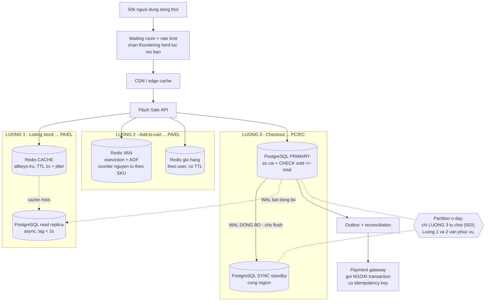

# ass4 — PACELC cho hệ thống Flash Sale

> **Loại bài:** B (thiết kế) thuần. Đề liệt kê 5 deliverable và **không có mục nào yêu cầu
> implement**, nên bài này không có mã nguồn — theo `CLAUDE.md`: *"Không tự thêm … nếu đề
> không yêu cầu."*

## Đề bài (nguyên văn)

```
Bối cảnh: Xây hệ thống "Flash Sale"

  - 50k người dùng đồng thời
  - SLO: P95 read < 80ms, P95 write < 120ms
  - Không được oversell
  - Chấp nhận hiển thị tồn kho trễ tối đa 2s ở trang listing
  - Thanh toán phải chính xác

Yêu cầu nộp:
  1. Phân loại PACELC cho từng luồng: Listing stock / Add-to-cart / Checkout
  2. Chọn DB và topology cho từng thành phần
  3. Đề xuất cấu hình/knobs
  4. Vẽ sơ đồ kiến trúc (Mermaid)
  5. Nêu rủi ro + cách giảm thiểu (lag, thundering herd, retry, idempotency)
```

---

## 0. Ý chính của cả bài

Đề đã **tự cho sẵn câu trả lời PACELC** ở hai dòng ràng buộc, chỉ là nói bằng ngôn ngữ nghiệp vụ:

| Dòng trong đề | Dịch sang PACELC |
|---|---|
| *"Chấp nhận hiển thị tồn kho trễ tối đa 2s ở trang listing"* | Luồng listing được phép **EL** — và 2s là **trần lag**, không phải lời khuyên |
| *"Không được oversell"* + *"Thanh toán phải chính xác"* | Luồng checkout buộc phải **PC/EC** |

Nên điều quan trọng nhất cần nói ra:

> **PACELC là thuộc tính của từng luồng, không phải của cả hệ thống.**
> Câu "hệ thống này là PA/EL" hay "hệ thống này là PC/EC" đều sai với bài này. Một hệ thống
> tốt là hệ thống **cố tình** chạy nhiều quadrant khác nhau ở các luồng khác nhau, và biết rõ
> ranh giới nằm ở đâu.

Từ đó sinh ra quyết định kiến trúc trung tâm: **tách hàng rào chống oversell thành hai lớp.**

```
Lop 1 - VAN (admission control), Redis:  chan ~99% traffic, NHANH, duoc phep SAI
Lop 2 - SO CAI (ledger), PostgreSQL:     hang rao that, CHAM hon, KHONG BAO GIO SAI
```

Nguyên tắc nối hai lớp: **van được phép sai theo hướng cho qua dư, không bao giờ được là nơi
đảm bảo bất biến.** Van sai → vài người bị từ chối ở bước checkout. Sổ cái sai → oversell.
Hai hậu quả đó cách nhau rất xa.

---

## 1. Giả định (do người làm bài tự đặt ra)

Đề cho SLO và ràng buộc, nhưng thiếu các thông tin sau. **Tất cả là giả định, không phải số đo.**

| Giả định | Giá trị | Vì sao ảnh hưởng |
|---|---|---|
| Số SKU tham gia flash sale | ~10–50 SKU, trong đó **1–3 SKU nóng** hút phần lớn traffic | Hot row/hot key là vấn đề chính, không phải tổng throughput |
| Tồn kho mỗi SKU nóng | Vài trăm đến vài nghìn | Rất nhỏ so với 50k người → tỉ lệ thắng thấp → **phải loại sớm, loại rẻ** |
| Thời lượng sale | Vài phút, tải dựng đứng ở giây 0 | Thundering herd là rủi ro số 1 |
| Tỉ lệ luồng | Listing ≫ add-to-cart ≫ checkout | Chỉ luồng nhỏ nhất mới cần CP |
| Triển khai | **Một region**, 3 AZ | Sync standby cùng region mới nằm vừa ngân sách 120ms |
| "50k đồng thời" | Người dùng đang mở trang, **không phải** 50k ghi/giây | Nếu là 50k ghi/giây thì thiết kế phải khác hẳn |
| Add-to-cart có trừ kho không | **Có** — giữ chỗ mềm (soft reservation) TTL 10 phút | Đây là quyết định thiết kế, đề không nói rõ |

> Giả định cuối là quan trọng nhất và tôi nêu riêng ra: nếu add-to-cart **không** giữ chỗ thì
> toàn bộ áp lực dồn vào checkout và bài toán dễ hơn nhiều. Tôi chọn phương án khó hơn vì
> flash sale thực tế luôn giữ chỗ — nếu không thì 50k người đều thêm được vào giỏ rồi 49.5k
> người thất bại ở bước cuối.

### Ngân sách độ trễ — tự phân bổ, **chưa phải số đo**

SLO là số đo tổng; để thiết kế được thì phải chia nó ra. Bảng dưới là **ngân sách ta tự đặt**,
**bắt buộc phải đo lại** khi triển khai:

| Luồng | Trần SLO | Phân bổ ngân sách | Hệ quả thiết kế |
|---|---|---|---|
| Listing (read) | **P95 < 80ms** | edge/CDN + LB + app ≈ nửa ngân sách; kho dữ liệu ≤ ~10ms; còn lại dự phòng | **Listing không được chạm PostgreSQL primary** trong đường nóng |
| Checkout (write) | **P95 < 120ms** | app + van Redis ≈ 1/4; transaction DB + chờ sync standby ≈ phần lớn phần còn lại | Sync standby **phải cùng region**; hot row phải được van chặn bớt |

Hai kết luận in đậm ở cột cuối là thứ thực sự lái kiến trúc. Các con số ms chỉ là cách chia
ngân sách, không được trích dẫn như kết quả benchmark.

---

## 2. Deliverable 1 — Phân loại PACELC cho từng luồng

| Luồng | **P** (khi partition) | **E** (lúc bình thường) | Kết luận |
|---|---|---|---|
| **Listing stock** | **A** — vẫn hiển thị, dùng số cũ | **L** — đọc cache/replica, không chạm primary | **PA/EL** |
| **Add-to-cart** | **A** — vẫn nhận, van Redis phục vụ tại chỗ | **L** — một lệnh Redis nguyên tử, không transaction DB | **PA/EL** |
| **Checkout** | **C** — từ chối, trả `503`, không đoán | **C** — commit chờ sync standby flush | **PC/EC** |

### 2.1. Listing stock → **PA/EL**

Đề nói thẳng *"chấp nhận trễ tối đa 2s"*. Đó là **giấy phép chính thức để chọn EL**.

- **Khi partition (PA):** replica mất liên lạc primary → vẫn phục vụ bằng dữ liệu cuối cùng
  nó có. Trang danh sách trắng xoá còn tệ hơn trang hiển thị số hơi cũ.
- **Lúc bình thường (EL):** đọc từ Redis cache (TTL 1s), miss thì xuống read replica. Không
  bao giờ đọc primary — vừa để giữ ngân sách 80ms, vừa để 50k người xem không giết primary
  đang lo checkout.

**"Trễ 2s" là ràng buộc vận hành chứ không phải lời khuyên.** Nó dịch thẳng thành một cảnh
báo cụ thể: nếu replication lag > 2s thì **rút replica đó khỏi pool listing**. Xem mục 4.

### 2.2. Add-to-cart → **PA/EL**

Add-to-cart gồm **hai việc khác nhau**, và tách chúng ra là mấu chốt:

| Việc | Dữ liệu | PACELC |
|---|---|---|
| Ghi giỏ hàng | Riêng từng user, **không có bất biến toàn cục** | PA/EL — hiển nhiên |
| Giữ chỗ mềm (trừ van) | Counter dùng chung theo SKU | PA/EL, nhưng **lệch có chủ đích về hướng an toàn** |

Vế thứ hai cần nói rõ, vì nghe có vẻ mâu thuẫn với *"không được oversell"*:

Van Redis chọn **A** — lúc partition vẫn nhận, lúc bình thường vẫn nhanh. Nó **có thể sai**.
Nhưng nó sai theo đúng một hướng: **cho qua nhiều hơn số hàng thật (over-admit)**. Người thứ
N+1 qua được van sẽ bị **lớp 2 chặn ở checkout**. Bất biến không hề bị đụng tới.

> Hướng sai còn lại — van cho qua **ít hơn** thực tế (under-admit) — mới là hướng nguy hiểm về
> kinh doanh, vì nó làm **bán hụt**: hàng còn mà hệ thống báo hết. Nó xảy ra khi có đơn treo
> (giữ chỗ rồi bỏ). Cách xử lý ở mục 5, rủi ro R8.

Đây chính là lý do add-to-cart được phép AP mà cả hệ thống vẫn không oversell: **A ở lớp van,
C ở lớp sổ cái.**

### 2.3. Checkout → **PC/EC**

Không còn chỗ để đánh đổi:

- **Khi partition (PC):** primary rơi vào phía thiểu số → **từ chối ghi**, trả `503` kèm
  `Retry-After`. Đoán "chắc là còn hàng" nghĩa là oversell; đoán "chắc là hết" nghĩa là bán hụt.
  Cả hai đều tệ hơn việc thành thật nói *"tôi không biết"*.
- **Lúc bình thường (EC):** mỗi commit chờ **ít nhất một sync standby** flush xuống đĩa. Đổi
  một round-trip nội region lấy việc **không mất đơn đã thu tiền**.

Chọn EL ở đây (bỏ sync standby) sẽ làm checkout nhanh hơn, nhưng primary chết đột ngột là mất
các commit chưa kịp sang standby — tức là có người **đã trả tiền mà không có đơn**. Đề nói
*"thanh toán phải chính xác"*, nên EL bị loại.

---

## 3. Deliverable 2 — DB và topology cho từng thành phần

| Thành phần | Chọn | Topology | Phương án bị loại và vì sao |
|---|---|---|---|
| Catalog / trang listing | **PostgreSQL 16** | 1 primary + 2 **async** read replica, phía trước có CDN | *Đọc thẳng primary*: vỡ ngân sách 80ms và giết primary đang lo checkout |
| Tồn kho hiển thị | **Redis** (instance cache) | TTL 1s + jitter, `allkeys-lru` | *Đọc realtime từ DB*: không ai yêu cầu — đề cho phép trễ 2s, dùng hết quyền đó đi |
| **Van giữ chỗ** | **Redis Cluster** (instance **riêng**) | 3 master + 3 replica, hash slot theo SKU, `noeviction` + AOF | *Dùng DB làm van*: 50k người tranh một dòng → lock convoy → vỡ P95 write |
| Giỏ hàng | **Redis** | Key theo user, có TTL | *PostgreSQL*: giỏ hàng không cần ACID, và làm phình primary vô ích |
| **Sổ cái đơn + tồn kho thật** | **PostgreSQL 16 + Patroni/etcd** | 1 primary + 1 **sync** standby + 1 async, **cùng region**, 3 AZ | *Cassandra/MongoDB*: không giữ nổi bất biến hữu hạn, hoặc không mang lại gì thêm |
| Thanh toán | **PostgreSQL** cùng cụm + **outbox** | Bảng `payment`, `idempotency_keys`, `outbox` | *Gọi payment gateway bên trong transaction*: giữ transaction mở qua mạng ngoài — hỏng cả hai đầu khi gateway chậm |

### 3.1. Vì sao PostgreSQL chứ không MySQL / Oracle

Đề gợi ý cả ba nên phải nói rõ:

- **MySQL 8 (InnoDB Cluster / Group Replication) làm được tương đương.** `INSERT … ON DUPLICATE
  KEY UPDATE` thay cho `ON CONFLICT`, semi-sync replication thay cho `synchronous_standby_names`.
  Nếu đội đã vận hành MySQL thì **giữ MySQL là lựa chọn đúng hơn** — chi phí đổi hệ quản trị
  lớn hơn lợi ích.
- **Chọn PostgreSQL vì:** `CHECK` constraint biểu đạt trực tiếp bất biến `sold <= total`,
  `INSERT … ON CONFLICT DO NOTHING` làm idempotency sạch sẽ, và nhất quán với [ass3](../ass3).
- **Loại Oracle:** không mang lại gì cho bài toán này để bù cho chi phí license.

### 3.2. Vì sao Redis chứ không phải một DB thứ hai

Van cần đúng hai thứ: **thao tác nguyên tử trên một counter**, và **độ trễ đủ nhỏ để nằm lọt
ngân sách**. Redis cho cả hai bằng một lệnh. Một DB quan hệ thứ hai chỉ lặp lại đúng vấn đề
hot row mà ta đang muốn tránh.

**Nhưng phải nhắc lại:** Redis ở đây **không phải database**. Nó là cái van. Nguồn sự thật duy
nhất là PostgreSQL. Mất sạch Redis thì hệ thống chậm đi và có thể over-admit, **nhưng không
sai số liệu**.

---

## 4. Deliverable 3 — Cấu hình / knobs

### 4.1. PostgreSQL — cụm sổ cái

| Knob | Giá trị đề xuất | Tác dụng |
|---|---|---|
| `synchronous_standby_names` | `'ANY 1 (sb_sync)'` | **Bắt buộc.** Không có dòng này thì knob dưới vô nghĩa với replica |
| `synchronous_commit` | `on` | Chờ standby flush xuống đĩa bền |
| Isolation | `read committed` (mặc định) | Đủ, vì trừ kho dùng một câu UPDATE nguyên tử (xem 4.2) |
| Connection pool | **PgBouncer, transaction mode** | 50k người không thể mỗi người một connection PostgreSQL |
| Định tuyến đọc | listing → **replica**; checkout & "đơn của tôi" → **primary** | Giữ ngân sách 80ms, bảo vệ primary |

> **Bẫy đã kiểm chứng trong tài liệu chính thức:** `synchronous_commit = on` **là giá trị mặc
> định**, nghe như replication đồng bộ đã bật sẵn. Nhưng khi `synchronous_standby_names` rỗng
> thì mọi mức khác `off` **chỉ đảm bảo flush WAL cục bộ**, không chờ standby nào cả. Viết
> "chúng tôi để mặc định nên đã là EC" là sai.

**Knob theo từng transaction — điểm đáng chú ý nhất của mục này:**

`synchronous_commit` đặt được **ở mức transaction**, không chỉ mức server:

```sql
-- Checkout: EC, cho standby flush
BEGIN; SET LOCAL synchronous_commit = on;   ...  COMMIT;

-- Ghi log/analytics: EL, khong cho ai ca
BEGIN; SET LOCAL synchronous_commit = local; ... COMMIT;
```

Tức là **vế E của PACELC chỉnh được ở mức từng câu lệnh**, không phải một lựa chọn cứng cho cả
hệ thống. Đây đúng là thứ đề đang hỏi: phân loại theo *luồng*, không theo *hệ thống*.

### 4.2. Câu lệnh trừ kho ở sổ cái

```sql
UPDATE stock
   SET sold = sold + :qty
 WHERE sku = :sku
   AND sold + :qty <= total;
-- kiem tra rowsAffected: 0 => het hang, tra 409/422
```

Ba điểm:

1. **Không cần `SELECT … FOR UPDATE` riêng.** Một câu UPDATE có điều kiện đã nguyên tử; tách
   làm hai câu chỉ thêm một khoảng hở và một round-trip.
2. **`rowsAffected = 0` là câu trả lời "hết hàng"**, không phải lỗi hệ thống.
3. Thêm `CHECK (sold <= total AND sold >= 0)` trên bảng làm **hàng rào cuối cùng**, phòng khi
   có service khác hoặc một câu UPDATE chạy tay đi vòng qua logic trên.

### 4.3. Redis — hai instance, **không dùng chung**

| Instance | `maxmemory-policy` | `appendonly` | Vì sao |
|---|---|---|---|
| **Cache** (tồn kho hiển thị, catalog) | `allkeys-lru` | `no` | Mất thì tính lại được |
| **Van** (counter giữ chỗ, giỏ hàng) | **`noeviction`** | **`yes`** + `appendfsync everysec` | Mất counter = mất van |

> **Bẫy đã kiểm chứng trong `redis.conf` chính thức (7.4.0):**
> - `maxmemory-policy` mặc định là **`noeviction`** — tốt cho counter. Nhưng rất nhiều đội đổi
>   sang `allkeys-lru` vì dùng Redis làm cache. **Nếu counter nằm chung instance đó thì nó có
>   thể bị evict khi đầy bộ nhớ** — van biến mất im lặng, và over-admit hàng loạt.
>   → Đó là lý do phải **tách hai instance**, không phải vì hiệu năng.
> - `appendonly` mặc định là **`no`**. Redis restart là counter về 0. Với van thì phải bật.

**Trừ van bằng Lua script, không bằng GET rồi SET:**

```lua
-- KEYS[1] = stock:{sku}   ARGV[1] = qty
local con = tonumber(redis.call('GET', KEYS[1]))
if con == nil or con < tonumber(ARGV[1]) then return -1 end
return redis.call('DECRBY', KEYS[1], ARGV[1])
```

Redis chạy script nguyên tử, nên không có khoảng hở giữa "kiểm tra" và "trừ". `GET` rồi `SET`
từ phía ứng dụng thì có, và ở 50k đồng thời thì khoảng hở đó chắc chắn bị khai thác.

### 4.4. Giám sát replication lag — biến SLO 2s thành hành động

Đề cho phép trễ **tối đa 2s**. Trần đó phải có người canh:

```sql
-- chay tren replica
SELECT now() - pg_last_xact_replay_timestamp() AS lag;
```

- `lag > 2s` → **rút replica khỏi pool listing** (health check trả unhealthy), dồn về replica
  còn lại hoặc về cache. Vi phạm SLO thì thà bớt một replica còn hơn phục vụ số sai.
- Cảnh báo khi `lag > 1s` để còn kịp xử lý trước khi chạm trần.

### 4.5. Read-your-writes cho trang "đơn của tôi"

Vừa checkout xong, user vào xem đơn. Nếu đọc replica thì **đơn chưa kịp sang** → user tưởng
mất tiền. Hai cách, chọn một:

| Cách | Làm sao | Đánh đổi |
|---|---|---|
| **Sticky to primary** | Sau khi ghi, ghim session đọc primary trong N giây | Đơn giản; thêm tải cho primary |
| **Chờ theo LSN** | Ghi xong lấy `pg_current_wal_lsn()` ở primary, gắn vào session; lúc đọc so với `pg_last_wal_replay_lsn()` của replica, chưa tới thì fallback primary | Chính xác hơn, phức tạp hơn |

Với bài này tôi chọn **sticky to primary**: số người vừa checkout xong rất nhỏ so với 50k người
đang xem listing, nên tải thêm không đáng kể, và code đơn giản hơn hẳn.

---

## 5. Deliverable 4 — Sơ đồ kiến trúc



Đọc sơ đồ theo ba đường:

1. **Listing** — dừng lại ở Redis cache, chỉ khi miss mới xuống replica. **Không có mũi tên nào
   từ listing tới primary.** Đó là điều kiện để giữ P95 read < 80ms.
2. **Add-to-cart** — chỉ chạm Redis. Không transaction, không chạm sổ cái.
3. **Checkout** — đường duy nhất chạm primary, và là đường duy nhất chờ sync standby. Cũng là
   đường duy nhất từ chối phục vụ khi partition.

---

## 6. Deliverable 5 — Rủi ro và cách giảm thiểu

### R1. Replication lag (đề nêu đích danh)

| | |
|---|---|
| **Xảy ra thế nào** | Replica tụt lại, listing hiển thị "còn 120" trong khi thực tế đã hết. User bấm vào rồi bị từ chối → mất lòng tin |
| **Giảm thiểu** | ① Health check theo `now() - pg_last_xact_replay_timestamp()`, **lag > 2s thì rút replica khỏi pool** (mục 4.4). ② Trang listing hiển thị **"sắp hết hàng"** thay vì con số chính xác — vừa đúng bản chất dữ liệu trễ, vừa không hứa điều không giữ được. ③ Read-your-writes bằng sticky-to-primary cho trang "đơn của tôi" (mục 4.5) |

> Ghi chú: hiển thị *"sắp hết"* thay vì *"còn 120"* là một **thay đổi sản phẩm**, không phải
> thay đổi kỹ thuật. Nhưng nó giải quyết vấn đề triệt để hơn mọi thủ thuật kỹ thuật, nên vẫn
> phải đề xuất.

### R2. Thundering herd — cache stampede (đề nêu đích danh)

| | |
|---|---|
| **Xảy ra thế nào** | Key tồn kho của SKU nóng có TTL 1s. Đúng lúc nó hết hạn, toàn bộ request đang bay cùng miss một lúc và **cùng đổ xuống replica**. Tải nhân lên hàng nghìn lần trong một nhịp |
| **Giảm thiểu** | ① **Single-flight**: chỉ một request được đi tính lại, số còn lại chờ kết quả đó. ② **TTL có jitter** (1s ± ngẫu nhiên) để các key không hết hạn đồng loạt. ③ **Làm mới sớm theo xác suất** — càng gần hết hạn càng có khả năng được refresh trước. ④ Tốt nhất: **push thay vì pull** — mỗi lần van Redis đổi thì cập nhật luôn cache, TTL chỉ còn là lưới an toàn |

### R3. Thundering herd — lúc mở bán

| | |
|---|---|
| **Xảy ra thế nào** | 50k người bấm F5 tại giây 0. Đây là tải khác hẳn R2: không phải cache miss mà là **tải thật**, và không cache nào đỡ được |
| **Giảm thiểu** | ① **Waiting room**: phát token trước giờ mở bán, chỉ token hợp lệ mới vào. ② **Rate limit theo user**, không chỉ theo IP. ③ **Van Redis loại sớm**: người thứ 2001 cho 2000 sản phẩm bị chặn ngay ở Redis, **không bao giờ chạm PostgreSQL**. Đây mới là lý do thật sự của cái van — không phải để nhanh, mà để **bảo vệ lớp dưới** |

### R4. Retry storm (đề nêu đích danh)

| | |
|---|---|
| **Xảy ra thế nào** | Hệ thống chậm → client retry → gateway retry → app retry. Tải nhân 3 đúng lúc hệ thống đang yếu nhất. Sự cố nhỏ thành sự cố lớn |
| **Giảm thiểu** | ① **Chỉ retry `5xx` và timeout. Không bao giờ retry `4xx`** — lỗi do request thì retry bao nhiêu lần cũng hỏng. ② **Exponential backoff + jitter** — thiếu jitter thì các client retry đồng pha, tự tạo ra đợt sóng mới. ③ **Retry budget**: tổng số retry không vượt quá ~10% số request, vượt thì ngừng. ④ **Circuit breaker**. ⑤ Trả `Retry-After` để client biết chờ bao lâu thay vì tự đoán |

### R5. Idempotency (đề nêu đích danh)

| | |
|---|---|
| **Xảy ra thế nào** | Checkout timeout ở giây thứ 3. Đơn **đã** được ghi nhưng response không về tới client. Client retry → trừ kho hai lần, thu tiền hai lần |
| **Giảm thiểu** | `Idempotency-Key` **bắt buộc** với `POST /checkout`, do **client sinh** (UUID) và gắn với một ý định mua duy nhất |

```sql
CREATE TABLE idempotency_keys (
    key           uuid PRIMARY KEY,
    request_hash  text        NOT NULL,
    response_body jsonb,
    created_at    timestamptz NOT NULL DEFAULT now()
);

-- Trong cung transaction voi viec tru kho:
INSERT INTO idempotency_keys (key, request_hash) VALUES (:key, :hash)
ON CONFLICT DO NOTHING;
-- rowsAffected = 1 -> lan dau, xu ly tiep
-- rowsAffected = 0 -> da xu ly roi, tra lai response_body da luu
```

Ba điều dễ làm sai:

- **Key phải do client sinh.** Server sinh key thì retry sẽ mang key mới → vô tác dụng.
- **Phải lưu cả `request_hash`.** Cùng key nhưng nội dung khác nhau là lỗi của client, phải
  trả `422` chứ không im lặng trả về kết quả cũ.
- **Phải nằm cùng transaction với việc trừ kho.** Tách ra là lại có khoảng hở.

### R6. Hot row contention

| | |
|---|---|
| **Xảy ra thế nào** | Mọi checkout của SKU nóng cùng `UPDATE` một dòng. Các transaction xếp hàng sau một khoá → P95 write vỡ dù CPU vẫn rảnh |
| **Giảm thiểu** | ① **Van Redis chặn trước** — chỉ số người có cơ hội thắng mới chạm DB. Với 2000 sản phẩm / 50k người, DB chỉ thấy ~2000 transaction chứ không phải 50k. ② Nếu vẫn nóng: **sharded counter** — chia tồn kho thành N dòng con (`sku`, `bucket`), mỗi request chọn ngẫu nhiên một bucket; gộp lại khi gần hết |

### R7. Mất Redis giữa chừng

| | |
|---|---|
| **Xảy ra thế nào** | Redis failover hoặc restart → counter về giá trị cũ / về 0 → van cho qua ồ ạt |
| **Giảm thiểu** | ① AOF `everysec` để giảm lượng mất. ② **Chấp nhận** — van được phép sai, `CHECK` ở PostgreSQL vẫn chặn. Hệ thống chậm lại và nhiều người bị từ chối ở checkout, **nhưng không oversell**. ③ Cảnh báo khi **tỉ lệ "qua van nhưng bị DB từ chối"** tăng vọt — đó là chỉ số sức khoẻ tốt nhất của cả kiến trúc hai lớp này |

### R8. Đơn treo → bán hụt

| | |
|---|---|
| **Xảy ra thế nào** | Giữ chỗ xong rồi bỏ đi không thanh toán. Hàng bị khoá vô ích, hết sale vẫn còn tồn kho chưa bán được |
| **Giảm thiểu** | ① **TTL cho giữ chỗ** (10 phút), hết hạn thì job trả counter về. ② Cho van một **buffer nhỏ** (cho qua nhiều hơn tồn kho một chút) để bù phần bỏ giỏ. Buffer to thì nhiều người bị từ chối ở checkout, buffer nhỏ thì bán hụt — **phải đo tỉ lệ bỏ giỏ thật rồi chỉnh**, không đoán |

### R9. Thanh toán hai lần với gateway ngoài

| | |
|---|---|
| **Xảy ra thế nào** | Gọi gateway bên trong transaction DB; gateway chậm → transaction giữ khoá hàng chục giây → vừa hỏng gateway vừa hỏng DB. Hoặc gọi xong mà transaction rollback → tiền đã thu, đơn không có |
| **Giảm thiểu** | ① **Không gọi mạng ngoài trong transaction.** ② **Outbox pattern**: transaction chỉ ghi đơn + một bản ghi outbox; một worker đọc outbox rồi gọi gateway. ③ Dùng **idempotency key của chính gateway**. ④ **Job đối soát (reconciliation)** chạy định kỳ so sổ của mình với sổ của gateway — đây là lưới an toàn cuối cùng, và là thứ duy nhất phát hiện được sai lệch mà mọi lớp trên đã bỏ sót |

---

## 7. Đánh đổi đã chấp nhận

| Mất gì | Vì sao chấp nhận |
|---|---|
| User có thể thấy "còn hàng" rồi bị từ chối ở checkout | Thay thế duy nhất là đọc realtime ở listing → vỡ P95 80ms và giết primary. Đề đã cho phép trễ 2s, nên đây là **đánh đổi đề đã đồng ý trước** |
| Thêm Redis = thêm một hệ phải vận hành, thêm một nguồn lỗi | Không có van thì 50k request đập thẳng vào hot row. Đổi lấy độ phức tạp này là xứng đáng |
| Checkout chậm hơn vì chờ sync standby | Đổi lấy "không mất đơn đã thu tiền" — đề yêu cầu thẳng |
| Kiến trúc phức tạp hơn nhiều so với một PostgreSQL | **Chỉ xứng đáng ở quy mô đề đưa ra.** Xem mục 8 |
| Tính đúng đắn phụ thuộc vào việc hai Redis instance được cấu hình đúng | Rủi ro cấu hình, không phải rủi ro thiết kế — phải đưa vào checklist triển khai, không để trong trí nhớ ai |

---

## 8. Khi nào thiết kế này sai

1. **Nếu "50k đồng thời" thực ra là 500.** Toàn bộ lớp van là over-engineering. Một PostgreSQL
   với `UPDATE … WHERE sold + qty <= total` là đủ, và đơn giản hơn nhiều. **Đây là khả năng dễ
   xảy ra nhất trong thực tế.**
2. **Nếu không có SKU nóng** (tải trải đều hàng nghìn SKU). Hot row biến mất → bỏ van, đi thẳng
   xuống DB.
3. **Nếu SLO nới ra** (ví dụ P95 read < 500ms). Bỏ được tầng cache, bớt hẳn R2 và R8.
4. **Nếu nghiệp vụ chấp nhận oversell và bù bằng voucher.** Lúc đó bỏ luôn lớp 2 khoá chặt,
   checkout cũng thành PA/EL, và hệ thống đơn giản đi rất nhiều. **Đây là quyết định kinh
   doanh, không phải kỹ thuật.**
5. **Nếu mở rộng đa region.** Sync standby xuyên lục địa không nằm vừa ngân sách 120ms. Phải
   **chia tồn kho theo region**, mỗi region giữ phần của mình và vẫn PC/EC cục bộ.
6. **Nếu thanh toán chuyển sang bất đồng bộ** ("đặt trước, trừ tiền sau"). Checkout hết cần EC
   ngay lập tức; bất biến chuyển sang một job đối soát. Đổi cả cách phân loại PACELC.

---

## 9. Nguồn đã kiểm chứng

| Khẳng định | Nguồn |
|---|---|
| `synchronous_commit` mặc định là `on`; khi `synchronous_standby_names` rỗng thì mọi mức khác `off` chỉ đảm bảo flush WAL **cục bộ** | [PostgreSQL — WAL configuration](https://www.postgresql.org/docs/current/runtime-config-wal.html) |
| Tên và ngữ nghĩa chính xác của `pg_current_wal_lsn()`, `pg_last_wal_replay_lsn()`, `pg_last_xact_replay_timestamp()`; ba hàm sau chỉ có nghĩa trên standby | [PostgreSQL — Admin functions](https://www.postgresql.org/docs/current/functions-admin.html) |
| `maxmemory-policy` mặc định là **`noeviction`**; `appendonly` mặc định là **`no`** | [`redis.conf` 7.4.0 (bản chính thức)](https://github.com/redis/redis/blob/7.4.0/redis.conf) |
| Danh sách đầy đủ eviction policy, và `noeviction` trả lỗi khi ghi thêm lúc đầy bộ nhớ | [Redis — Key eviction](https://redis.io/docs/latest/develop/reference/eviction/) |

**Chưa kiểm chứng — nên không khẳng định trong bài:**

- **Mọi con số độ trễ ở mục 1** là **ngân sách tự phân bổ**, không phải số đo. Phải đo lại bằng
  load test trên hạ tầng thật trước khi tin.
- **Tỉ lệ bỏ giỏ hàng** quyết định buffer của van (R8). Không có số thật thì không chọn được
  buffer — phải đo, không đoán.
- **Thời gian failover của Patroni** phụ thuộc `ttl`/`loop_wait`; phải đo khi triển khai.
- **Ngưỡng mà hot row bắt đầu vỡ P95** phụ thuộc phần cứng và kích thước transaction. Con số
  "50k thì vỡ, 500 thì không" ở mục 8 là **phỏng đoán định tính**, phải load test mới biết
  điểm gãy thật nằm ở đâu.
